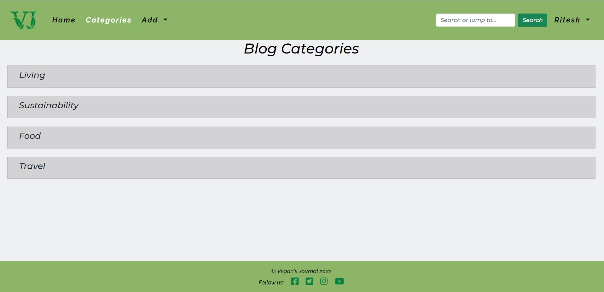
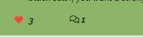
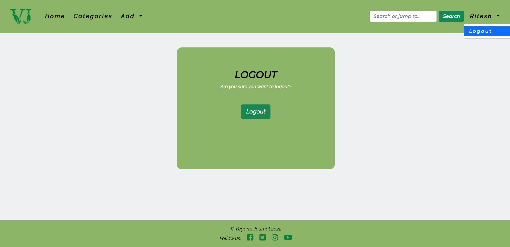
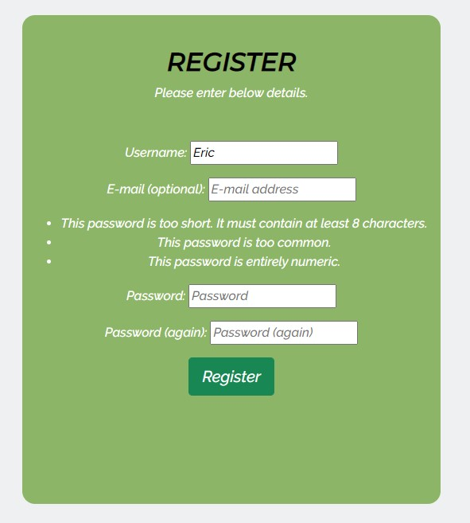
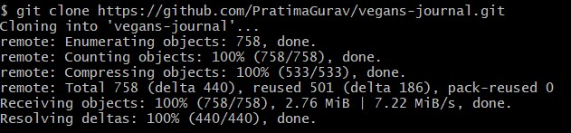

# Vegan's Journal Blog

## Code Institute: Portfolio Project 4

### Full-Stack Toolkit site.

![Responsive]

[Click here to view the live project.]

[Click here to view the repository.]

## Table of Contents:
- [User Experience (UX)]  

- [Features]

- [Technologies Used]
  
- [Testing]

- [Deployment]

- [Credits]

- [Acknowledgements]
    

## User Experience (UX)

### Introduction

Vegan's Journal is a full-stack application using mainly the Django full-stack web framework. The purpose of the site is to allow users to connect, spread and share ideas or knowledge about Vegan. Provides a login mechanism where users can login create a category and post. 

     
### Audience
The site is targetted to people who wants to know about Vegan and / or trying to be vegan.    

### User stories
GitHub’s Kanban feature was used to track the progress of user stories. 

  #### Site User
   1. I want to view a list of posts so that I can select one to read.
   2. I want to search a blog post(using relevant word) and ability to click on a post to read the full article / text.
   3. I want to view the number of likes on each post so that I can see which is the most popular.
   4. I want to view comments on an individual post so that I can read the conversation.
   5. I want to register an account so that I can comment and like.
   6. I want to create, edit and delete my post.
   7. I want to create a category of my own to add content on the site. 
   8. I want to leave comments on a post so that I can be involved in the conversation/s.
   9. I want to like or unlike a post so that I can interact with the content.
  

  #### Site Admin
   1. I want to create, read, update and delete posts so that I can manage the blog content.
   2. I can approve or disapprove comments so that I can filter out objectionable comments.
   3. I want to view the number of likes on each post so that I can see which is the most popular or viral.
   4. I want to view comments on an individual post so that I can read the conversation.

    
### Design

  - #### Color Scheme
    The main colours used for the site are Dollar Bill Green(#8CB567), La Salle Green (#08823F), Seashell (#EFF0F2), Golden Bell (#E28C1B), white (#FFFFFF) and black (#000000). These colours complement eachother and maintain good contrast levels.

  - #### Typography
    Raleway italic font is the main font used throughout the whole website with Sans Serif as the fallback font in case for any reason the font isn't being imported into the site correctly. Montserrat italic is used for headings with Sans Serif as the fallback.  

  - #### Wireframes
    Balsamiq was used to create wireframes for mobile, tablet/ipad and desktop.
    
    [Desktop](documentation/wireframes/desktop.pdf) |
    [Tablet](documentation/wireframes/ipad.pdf) |
    [Mobile](documentation/wireframes/mobile.pdf) |
   
    
## Features

 ### Existing Features

  The website is comprised of:

  1. Home page.
  
  2. Blog page.
  
  3. Blog-categories page.
  
  4. Blog categories dropdown.
  
  5. Categories list page.
  
  6. Add category page.
  
  7. Add post page.
  
  8. Add dropdown.
  
  9. Comments.
  
  10. Upvote.
  
      Downvote
  
  11. Register page.
  
  12. Login page.
  
  13. Logout page.
  
  14. Search bar.
  
  15. Search page.
  
     
All Pages on the website have:

* A favicon icon.
    
* A responsive navbar.
    
* A responsive footer.
    

### Future Enhancements 
  - Add function to create a user profile and edit / update profile setting with an option to add first_name, last_name, last_logged_in.
  - Implement a function to bookmark a page.
  - Add more messages for users that is while logging out, adding posts.
  - Add subscribe page for users to receive weekly updates.
  - Function to view most popular blog posts.

## Technologies Used

### Languages, Frameworks, Libraries & Programs Used

  - [HTML](https://en.wikipedia.org/wiki/HTML) was used to structure the site.
  - [CSS](https://en.wikipedia.org/wiki/CSS) was used to design the site. 
  - [JavaScript](https://en.wikipedia.org/wiki/JavaScript) was used to display messages to the user.
  - [Python+Django](https://en.wikipedia.org/wiki/Django_(web_framework)) framework.
  - [PostgresSQL](https://en.wikipedia.org/wiki/PostgreSQL) was used as relational database. 
  - [MARKDOWN](https://en.wikipedia.org/wiki/Markdown) was used to update Readme.
  - [Google Fonts](https://fonts.google.com/) were used to import the font into the style.css file which is used on all pages throughout the project.
  - [Font Awesome](https://fontawesome.com/) was used on all pages throughout the website to add icons for aesthetic and UX purposes.
  - [Git](https://git-scm.com/) was used for version control by utilizing the Gitpod terminal to commit to Git and Push to GitHub.
  - [GitHub](https://github.com/) was used to store the projects code after being pushed from Git.   
  - [Balsamiq](https://balsamiq.com/) was used to create the wireframes during the design process. 
  - [Color Adobe](https://color.adobe.com/) was used to select different colours used on the website. 
  - [Cloudinary](https://cloudinary.com/home-3722) was used to store images. 
  - [Heroku](https://heroku.com/) was used for deployment and hosting environment. 
  - [Favicon](https://favicon.io/) was used to create favicon.
  - [Canva](https://www.canva.com/) was used to create free logo.
  - [TinyPNG](https://tinypng.com/) was used to compress images.
    
    
## Testing

### Bugs
- Disorted form (add post page)
  - [Error](documentation/testing/bugs/add_post.png) no styling for the comments section.
    Used ckeditor to style the content section but the same was not displayed in the live site with a 404 [Error](documentation/testing/bugs/ckeditor-error.jpg). 
  - [Solution](documentation/testing/bugs/add-post-fix.jpg)Checked with Mentor who told me to check with the tutor team who advised me to rescope the same. Used css styling to style the content form on all devices.

- NoReverseMatch 
  - [Error](documentation/testing/bugs/no-reverse-path.png) No Reverse match found while adding a post to the site.
    There was no slug to the modal, when it was saved, the same slug(an empty string) was used over and over again.
  - [Solution](documentation/testing/bugs/sumbit_post_fix.png) Took the title of the post, and used that as the slug, that what is the save method if the modal is doing, the second error was deleting posts that had no slug to tidy up. 
   

### Validation

- [W3C Markup Validator](https://validator.w3.org/nu/)was used to validate every HTML page of the project to ensure there are no  syntax errors. 
  Results of the same can be found [Here](documentation/testing/html)

- [PEP8](http://pep8online.com/)was used to validate python code.
 Results of the same can be found [Here](documentation/testing/pep8)

- [W3C CSS Validator](https://jigsaw.w3.org/css-validator/#validate_by_input)was used to validate CSS.
  Results of the same can be found [Here](documentation/testing/css)

### Further Testing

 - User trying to register with no details provided.
 

 - User trying to register with the username which already exists.
 

 - User trying to register using password which does not meet standard password requirement guidelines.
 

 - User trying to login with no details provided.
 

 - User trying to login with incorrect password.
 

 - User trying to submit a post without blog snippet.
 

 - User trying to submit a blank comment.
 

 - User gets prompted before deleting their post in order to avoid accidentally deleting their posts. 
 

  - ### Known Bugs

## Deployment

### Using Heroku
- Development Enviroment
  1.  Create env.py it needs to contain these 3 variables.
    - [Cloudinary](https://cloudinary.com/)
    - Secret key is the password of your choice.
    - [Heroku](https://id.heroku.com/) postgreSQL.
    
  2. Create requirements.txt file.
  3. Create Procfile containing application name to ensure proper formatting to avoid the deployment to fail.
  4. Commit and push deployment changes to Github.
  5. Create an account and login to Heroku
    - Create a new app, with an appropriate app name and choose a region.
    
    - In Resources add Heroku Postgres.
    
    - Within your newly created app go to settings go to Config Vars use the DATABASE_URL Value and add it to your env.py file also you need to connect it via settings.py.
    
    - Create a SECRET_KEY Key and the Value as the desired key.
    - Then go to the Deploy tab next to Deployment Method, click GitHub to connect your account and repository.
    - At the bottom of the page hit deploy branch making sure it is set to main.

 

### Making a Local Clone

  1. Log in to GitHub and navigate to the [GitHub Repository](https://github.com/PratimaGurav/vegans-journal)
  2. To clone the repository using HTTPS, click Code and copy the address. 
  
  3. Navigate to Git Bash and clone the repository. 
  
  4. Press Enter and your local clone will be created. 
  

## Credits

### Code
- 
- 

### Content
- https://theveganword.com/ site was used to add content to the blogpage.
-  
    

## Acknowledgements

  -   My Mentor for continuous helpful feedback and advises.
  -   All the tutors Sean for helping me understand and fix few bugs.

## [BACK TO TOP]