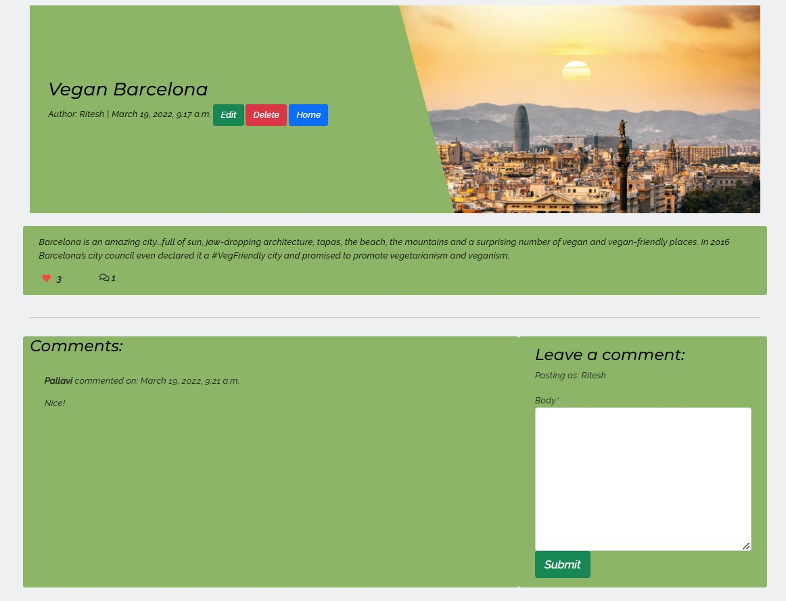
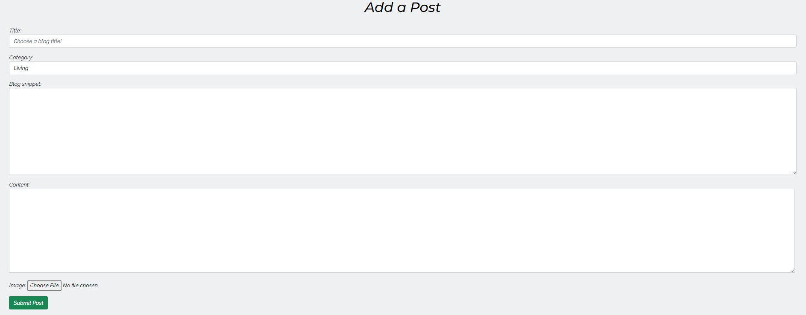
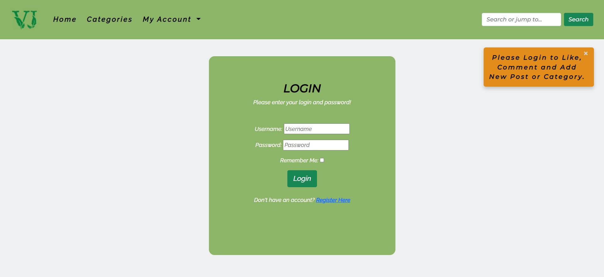
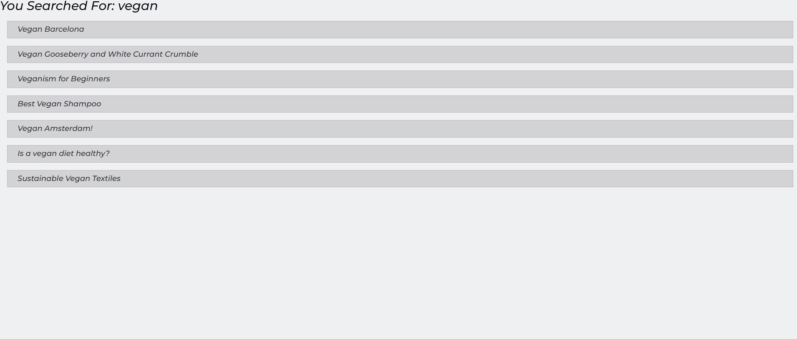

# Vegan's Journal Blog

## Code Institute: Portfolio Project 4

### Full-Stack Toolkit site.

![Responsive]

[Click here to view the live project.]

[Click here to view the repository.]

## Table of Contents:
- [User Experience (UX)]  

- [Features]

- [Technologies Used]
  
- [Testing]

- [Deployment]

- [Credits]

- [Acknowledgements]
    

## User Experience (UX)

### Introduction

Vegan's Journal is a full-stack application using mainly the Django full-stack web framework. The purpose of the site is to allow users to connect, spread and share ideas or knowledge about Vegan. 

     
### Audience
The site is targetted to people who wants to know about Vegan and / or trying to be vegan.    

### User stories
I have used GitHub’s Kanban feature to handle the user stories. 

  #### Site User
   1. I want to view a list of posts so that I can select one to read.
   2. I want to search a blog post(using relevant word) and ability to click on a post to read the full article / text.
   3. I want to view the number of likes on each post so that I can see which is the most popular or viral.
   4. I want to view comments on an individual post so that I can read the conversation.
   5. I want to register an account so that I can comment and like.
   6. I want to create, edit and delete my post.
   7. I want to create a category of my own to add content on the site. 
   8. I want to leave comments on a post so that I can be involved in the conversation/s.
   9. I want to like or unlike a post so that I can interact with the content.
   10. I want to create draft posts so that I can finish writing the content later.

  #### Site Admin
   1. I want to create, read, update and delete posts so that I can manage the blog content.
   2. I can approve or disapprove comments so that I can filter out objectionable comments.
   3. I want to view the number of likes on each post so that I can see which is the most popular or viral.
   4. I want to view comments on an individual post so that I can read the conversation.
   5. I want to create draft posts so that I can finish writing the content later.

    
### Design

  - #### Color Scheme
    The main colours used for the site are Dollar Bill Green(#8CB567), La Salle Green (#08823F), Seashell (#EFF0F2), Golden Bell (#E28C1B), white (#FFFFFF) and black (#000000). These colours complement eachother and maintain good contrast levels.

  - #### Typography
    Raleway italic font is the main font used throughout the whole website with Sans Serif as the fallback font in case for any reason the font isn't being imported into the site correctly. Montserrat italic is used for headings with Sans Serif as the fallback.  
   
    
## Features

 ### Existing Features

  The website is comprised of:

  1. Home page.
  
  2. Blog page.
  
  3. Blog-categories page.
  
  4. Blog categories dropdown.
  
  5. Categories list page.
  
  6. Add category page.
  
  7. Add post page.
  
  8. Add dropdown.
  
  9. Comments.
  
  10. Up/downvote.
  
  
  
  11. Register page.
  
  12. Login page.
  
  13. Logout page.
  
  14. Search bar.
  
  15. Search page.
  
     
All Pages on the website have:

* A favicon icon.
    
* A responsive navbar.
    
* A responsive footer.
    

### Future Enhancements 
  - 

## Technologies Used

### Languages, Frameworks, Libraries & Programs Used

  - [HTML](https://en.wikipedia.org/wiki/HTML) was used to structure the site.
  - [CSS](https://en.wikipedia.org/wiki/CSS) was used to design the site. 
  - [JavaScript](https://en.wikipedia.org/wiki/JavaScript) was used to display messages to the user.
  - [Python+Django](https://en.wikipedia.org/wiki/Django_(web_framework)) framework.
  - [PostgresSQL](https://en.wikipedia.org/wiki/PostgreSQL) was used as relational database. 
  - [MARKDOWN](https://en.wikipedia.org/wiki/Markdown) was used to update Readme.
  - [Google Fonts](https://fonts.google.com/) were used to import the font into the style.css file which is used on all pages throughout the project.
  - [Font Awesome](https://fontawesome.com/) was used on all pages throughout the website to add icons for aesthetic and UX purposes.
  - [Git](https://git-scm.com/) was used for version control by utilizing the Gitpod terminal to commit to Git and Push to GitHub.
  - [GitHub](https://github.com/) was used to store the projects code after being pushed from Git.   
  - [Balsamiq](https://balsamiq.com/) was used to create the wireframes during the design process. 
  - [Color Adobe](https://color.adobe.com/) was used to select different colours used on the website. 
  - [Cloudinary](https://cloudinary.com/home-3722) was used to store images. 
  - [Heroku](https://heroku.com/) was used for deployment and hosting environment. 
  - [Favicon](https://favicon.io/) was used to create favicon.
    
    
## Testing

### Bugs
   

### Validation
 

### Further Testing

 - 

  - ### Known Bugs

    - 

## Deployment

### GitHub Pages
 

### Making a Local Clone

  1. Log in to GitHub and navigate to the [GitHub Repository]
  2. To clone the repository using HTTPS, click Code and copy the address. 
  ![Clone Repository]
  3. Navigate to Git Bash and clone the repository. 
  ![Clone-Command]
  4. Press Enter and your local clone will be created. 
  ![Clone-Output]

## Credits

### Code
- 
- 

### Content
- https://nutriciously.com/how-to-eat-healthy-on-a-budget/
- https://www.yourdailyvegan.com/environment/ 
    

## Acknowledgements

  -   My Mentor for continuous helpful feedback and advises.
  -   All the tutors Sean for helping me understand and fix few bugs.

## [BACK TO TOP]